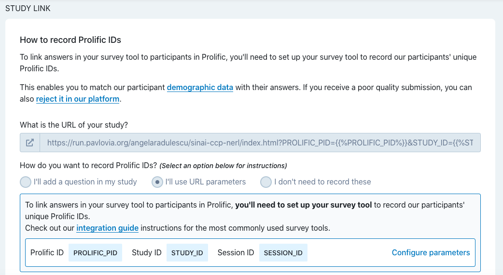
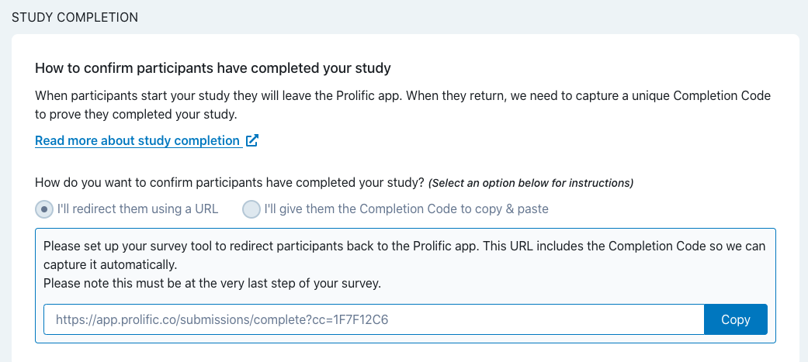

# Running Online Experiments: Things to Remember When Integrating jsPsych, Pavlovia, & Prolific

## Resources 
<br>[Running jsPsych experiments from Pavlovia](https://pavlovia.org/docs/experiments/create-jsPsych) </br>
<br>[Running jsPsych experiments from Pavlovia](https://pavlovia.org/js-psych)</br>
<br>[Integrating jsPsych with Prolific](https://www.jspsych.org/7.0/overview/prolific/index.html)</br>
<br>[Recruiting with Prolific](https://www.psychopy.org/online/prolificIntegration.html)</br>

1. **Important!** Make sure Prolific IDs are saved by including this code <em>anywhere</em> in your index.html file: 
```
  // capture info from Prolific 
  var subject_id = jsPsych.data.getURLVariable('PROLIFIC_PID');
  var study_id = jsPsych.data.getURLVariable('STUDY_ID');
  var session_id = jsPsych.data.getURLVariable('SESSION_ID');
  
  jsPsych.data.addProperties({
      subject_id: subject_id,
      study_id: study_id,
      session_id: session_id,
  });

```
When creating your study on Prolific, insert the URL generated by Pavlovia and select "I'll use URL parameters" when asked how you'd like to record Prolific IDs: 




2. **Important!** Make sure all data is saved on Pavlovia's server before participants are redirected to Prolific by including this code within the ```pavlovia_finish``` variable in your index.html file:

```
// finish connection with pavlovia.org and make sure data is saved before server redirects participants to prolific
  	var pavlovia_finish = {
  	type: "pavlovia",
  	command: "finish",
  	dataFilter: function(data){
  	    console.log(jsPsych.data.get().csv()); // alternatively, .json can be used here instead of .csv
  	    return data;
  	},
  	completedCallback: function(){
  	    alert(`Data successfully submitted. Thank you for participating!`);
    }
  	};
  	timeline.push(pavlovia_finish);

```

The Pavlovia plugin-in (version - "pavlovia-2020.4") can be downloaded [HERE](https://gitlab.pavlovia.org/tpronk/jsPsych_SimpleReactionTime/blob/master/jspsych-pavlovia-2020.4.js). This version contains the ```completedCallback``` function seen in the code above. By using this plug-in and calling this function within the ```pavlovia_finish``` variable, participants must wait a few seconds after finishing the task for the data to be confirmed on Pavlovia's servers. Then, participants receive a notification stating, “Data successfully submitted. Thank you for participating!” Participants press ‘OK’ and are directed to a screen with the Prolific completion URL (see below for instructions regarding Prolific redirect).

3. **Important!** To redirect Participants to Prolific upon completion include this code in your index.html file <em>after</em> the connection to Pavlovia is finished (i.e., following the pavlovia_finish variable): 

```
  	// redirect participants to Prolific 
  	
  	var prolific_redirect = {
  type: "html-keyboard-response",
  stimulus: `<p>You've finished the task. Thanks for participating!</p>
    <p><a href="https://app.prolific.co/submissions/complete?cc=XXXXXX">Click here to return to Prolific and complete the study</a>.</p>`,
  choices: "NO_KEYS"
};
timeline.push(prolific_redirect);

```
Copy and paste the Prolific completion URL for your study by selecting "I'll redirect them using a URL" when creating the study on Prolific:




